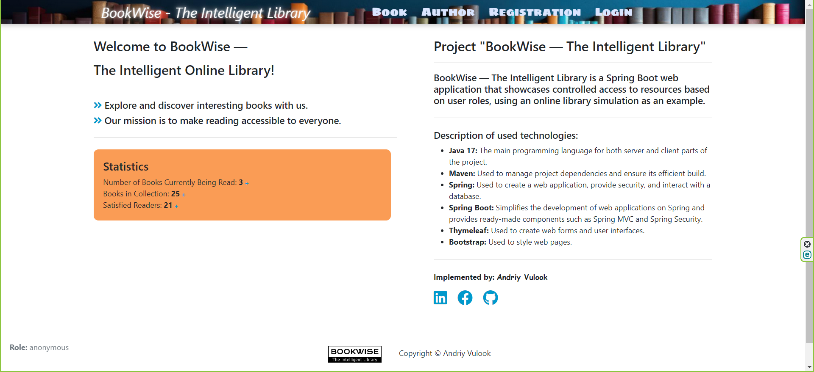
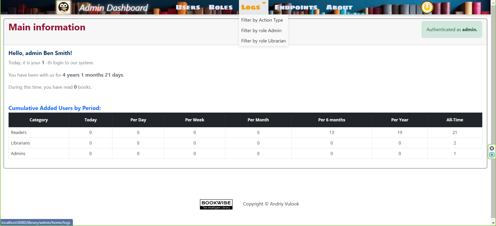

# BOOK-WISE PROJECT "The Intelligent Online Library"
___

## Огляд проєкту

Проєкт “BookWise" - це веб-додаток на базі SpringBoot, який демонструє контрольований доступ до ресурсів онлайн-бібліотеки в залежності від ролі користувача.

Читач ("READER") може ідентифікувати себе в системі та взяти книгу для читання (за 1 раз не більше 4-ох книг), а бібліотекар ("LIBRARIAN") - погодити ці книги для читання та погодити їх повернення. Також доступний перегляд ресурсів онлайн-бібліотеки анонімному користувачу.

Зручна форма обліку книг дозволяє контролювати весь процес від читання до повернення книги назад в бібліотеку.

Валідація облікового запису читача здійснюється через електронну пошту. Передбачено механізм відновлення забутого пароля.

Адміністратор системи (“ADMIN") має широкий набір інструментів для управління користувачами та контролю за їх діяльністю в систем.

Для перегляду роботи проєкту запустіть його в локальному середовищі та відкрийте посилання у браузері: http://localhost:8080.
___

___

### Опис використаних технологій

Проєкт реалізовано мовою програмування Java за архітектурним шаблоном MVC. 
Компоненти проєкт організовані у різні пакети та класи для полегшення розуміння та підтримки коду.

- **Java 17:** Основна мова розробки для серверної та клієнтської частини проєкт.
- **Maven:** Використовується для управління залежностями проєкт та забезпечення його ефективної збірки.
- **Spring Boot 3.2.1:** Спрощує розробку веб-додатків на Spring та надає готові компоненти, такі як Spring MVC, взаємодія з базою даних, і Spring Security.
- **Hibernate:** Забезпечує об'єктно-реляційне відображення, що дозволяє легко взаємодіяти з даними бази даних.
- **Thymeleaf:** Використовується для створення веб-форм та інтерфейсів користувача.
- **Bootstrap:** Використовується для стилізації веб-сторінки.
___

___

___
